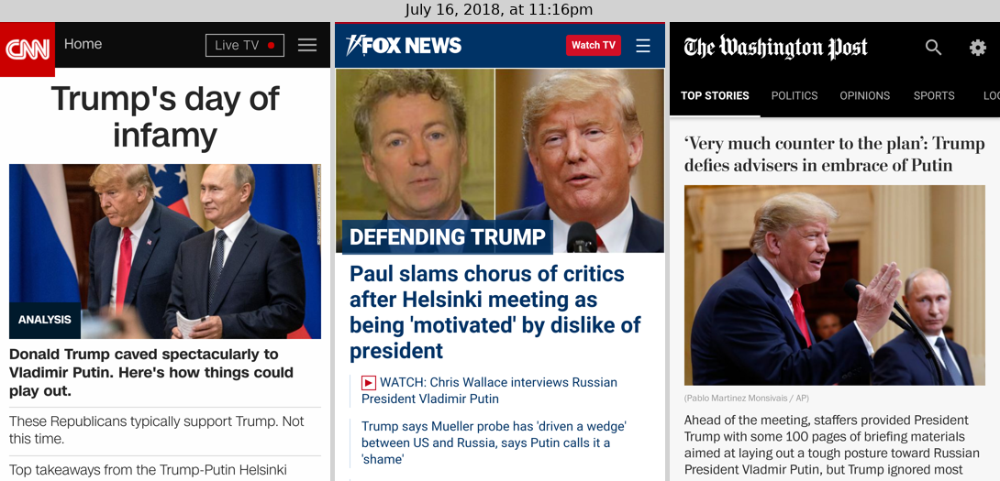
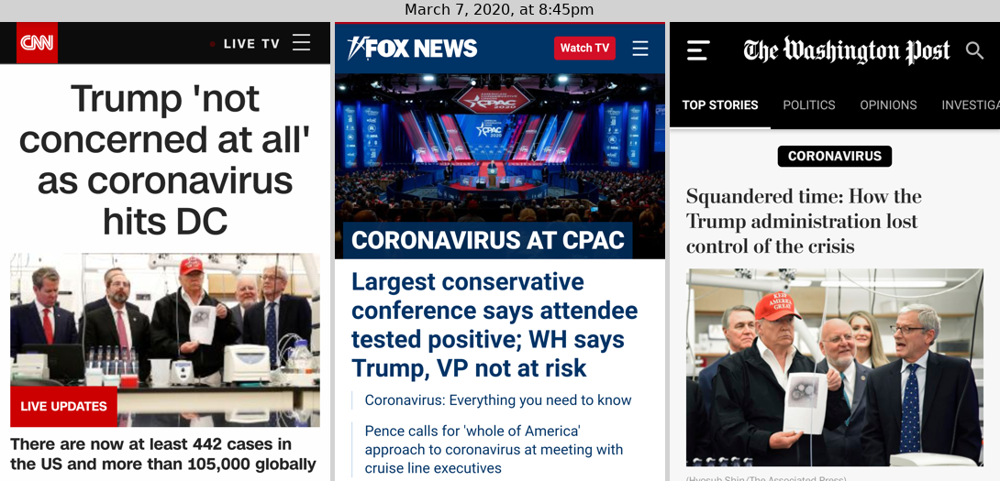
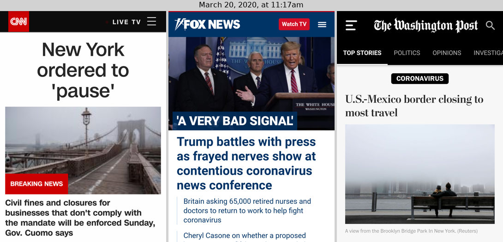
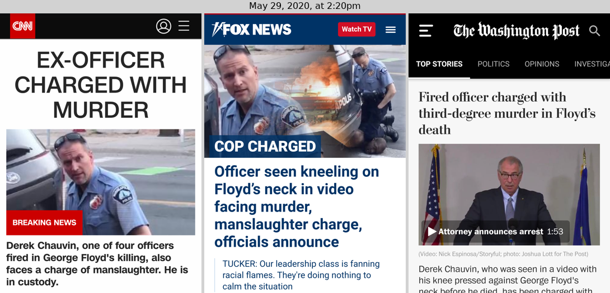
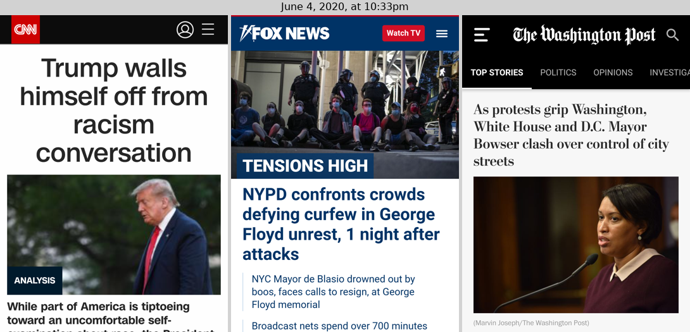

In June 2018 I started taking concurrent screenshots of CNN, Fox and the Washington Post, to put them side by side and see how they compare. I was curious about how their reporting on events would compare, or sometimes what stories they would prioritize.

**Methodology:** I made little in the way of efforts to control sampling scientifically. I'd just take three screenshots once whenever I remembered to do so. Sometimes, this would be spontaneous—I'd just be checking the news and I'd just decide to do so. More often, there'd be some event significant enough to uniformly consume most news outlets, which would prompt me to take the screenshots.

For consistency and practicality, I took whatever happened to be on the front page of my phone screen. Bear in mind that this misses the more complete desktop version. I swiped away "breaking news alerts" that were dismissable (though I forgot a couple of times). The choice of news sites was somewhat arbitrary, but I felt more than three would be too much data to take in.

I wrote a script to go through the screenshots and stitch them together; you can [see the script here](https://github.com/czlee/news-screenshots/blob/main/sort.py). I normally took the screenshots in a group within about a minute, though sometimes I'd get held up, so the script uses a threshold of six minutes to group screenshots together. The time on the stitched images refers to the median timestamp among the three screenshots.

## Screenshots

