_Chuan-Zheng Lee_  
_January 21, 2021_

In June 2018 I started taking concurrent screenshots of CNN, Fox News and the
Washington Post, to put them side by side. I was curious about how their
reporting on events would compare, or sometimes what stories they would
prioritize.

**Methodology:** I made little in the way of efforts to control sampling
scientifically. I'd just take three screenshots once whenever I remembered to do
so. Sometimes, this would be spontaneous. More often, there'd be some event
significant enough to uniformly consume most news outlets, which would prompt me
to take the screenshots. I mention this because lead headlines change often, so
there's no way I have anything close to a complete picture with these.

For consistency and practicality, I took only whatever happened to be on the
front page of my phone screen. Bear in mind that this misses the more complete
desktop version. I swiped away "breaking news alerts" that were dismissable
(though I forgot a couple of times). The choice of news sites was somewhat
arbitrary, but I felt more than three would be too much data to take in.

I wrote a script to sort through the screenshots and stitch them together; you
can [see the script
here](https://github.com/czlee/news-screenshots/blob/main/sort.py). I normally
took each group of three screenshots within about a minute, though sometimes I'd
get held up, so the script uses a threshold of six minutes to group screenshots
together. The time on the stitched images refers to the median timestamp among
the three screenshots.

**Commentary:** I'd rather leave the judgement to you, but my rough impression
was that while there are noticeable differences in emphasis between the outlets
a lot of the time, I wouldn't describe it nearly all the time: during major
events like disasters or elections, they tended to run the same lead headlines.

All times are in Pacific time.

## Screenshots

The two groups above deserve a little more commentary. The alleged murderer of
Mollie Tibbetts, who is an undocumented immigrant, was arrested on the same day
that Michael Cohen pleaded guilty to a range of election-related offenses. You
can see which stories outlets prioritized above (the above two are basically
from the same day). While CNN and WaPo covered the case, it wasn't a major story
on either at the time. But on September 1, a bit more than a week later,
Tibbetts' father had a column published in the Des Moines Register, asking
politicians not to politicize her death to advance views that she believed were
racist.
[CNN](https://www.cnn.com/2018/09/02/us/mollie-tibbetts-father-op-ed/index.html)
and
[WaPo](https://www.washingtonpost.com/nation/2018/09/02/mollie-tibbettss-dad-dont-use-her-death-push-views-she-believed-were-profoundly-racist/?utm_term=.192f696df2da)
then promptly covered it, and from memory it was on their desktop front page but
was not their lead article, but I don't have screenshots. As far as I could
tell, this article received no attention on Fox, not even a downpage article.

Note, though, that Fox turned to the Cohen story the next morning, as in the
group below.

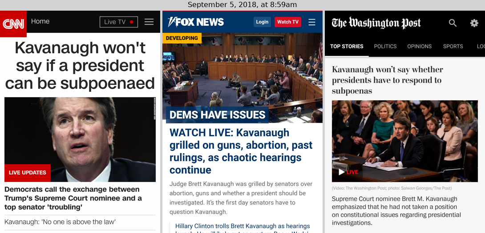

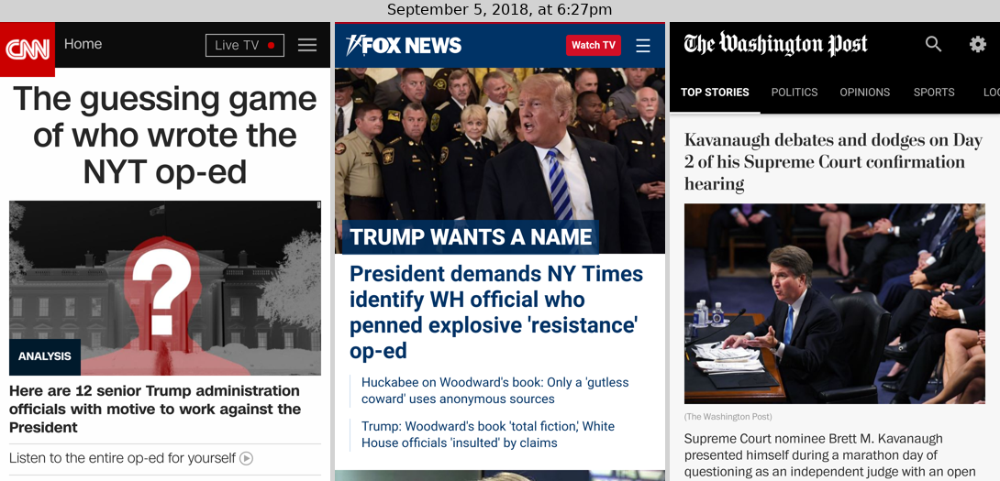

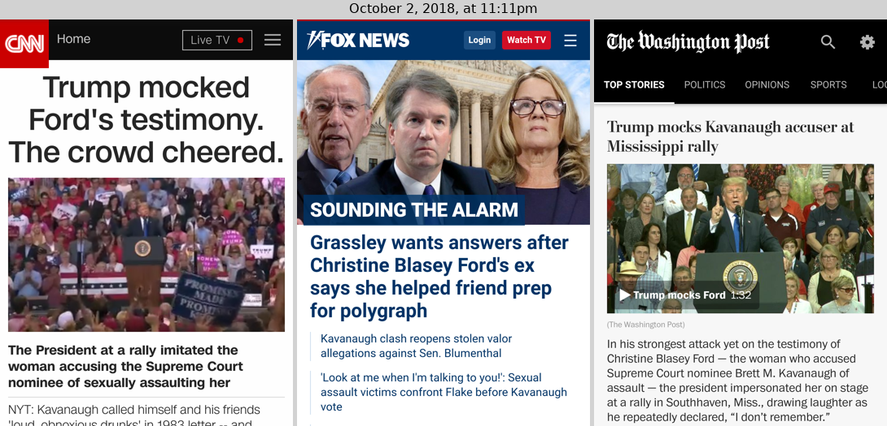

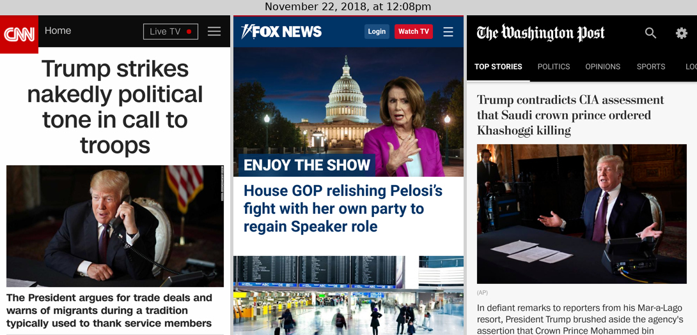

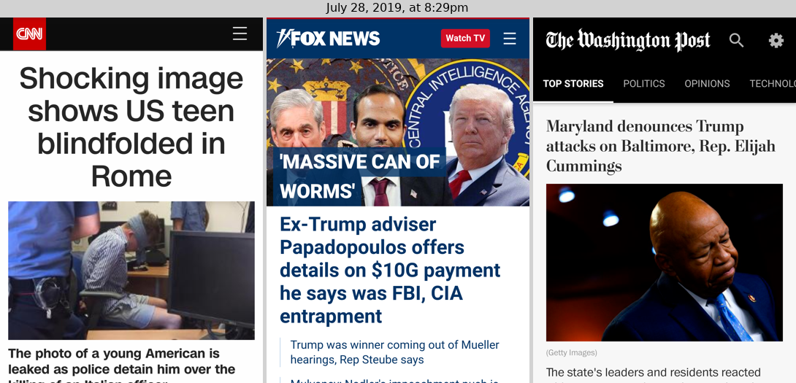

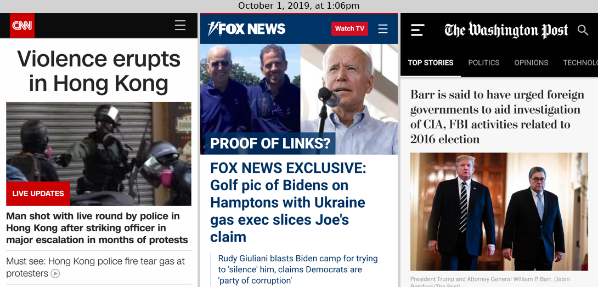

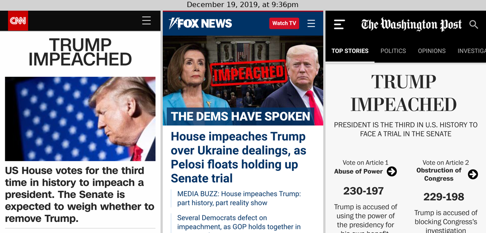

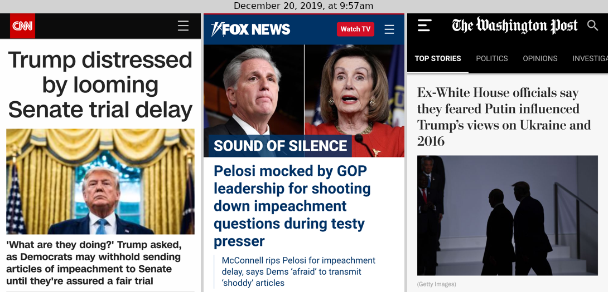

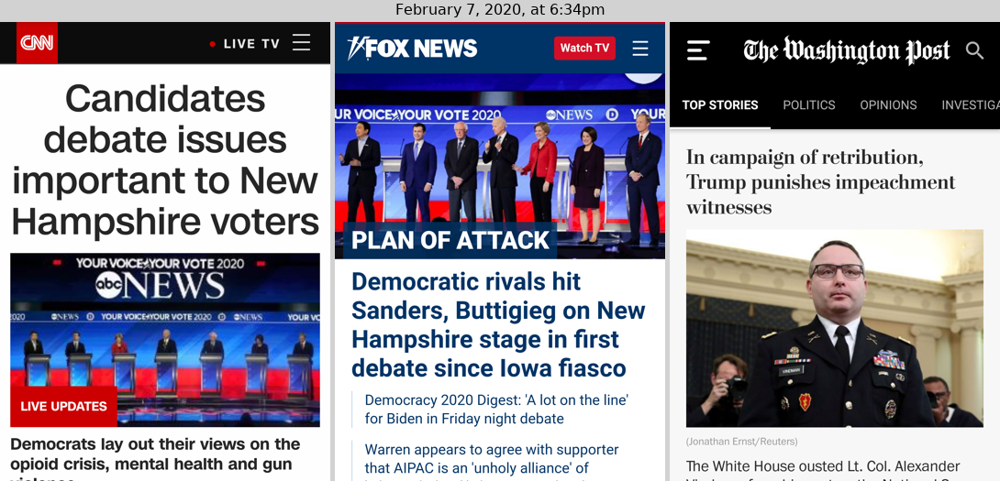

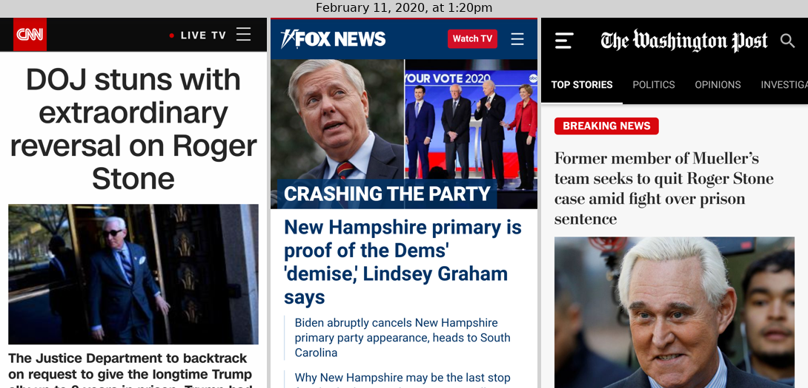

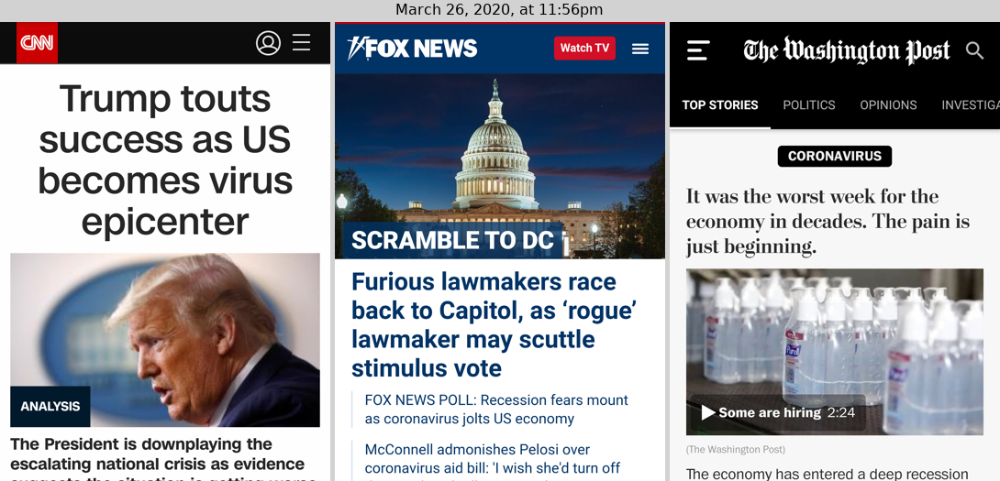

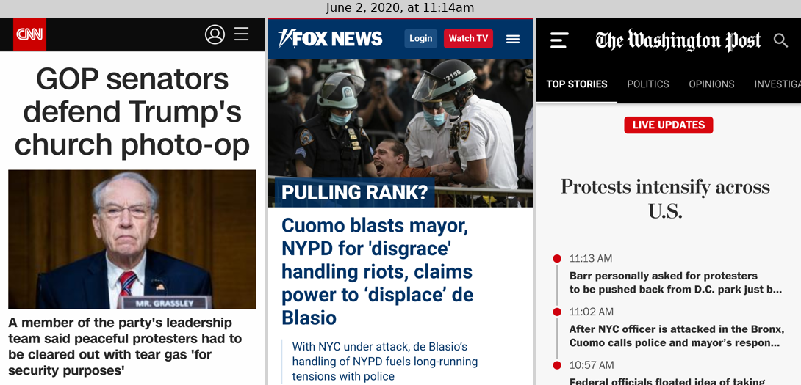

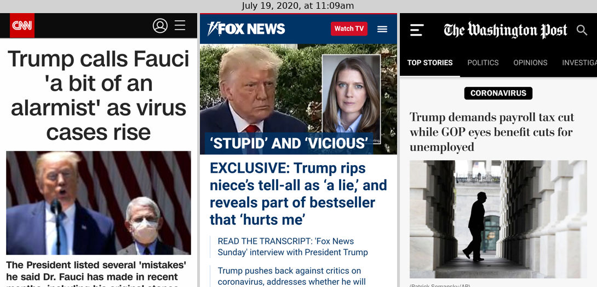

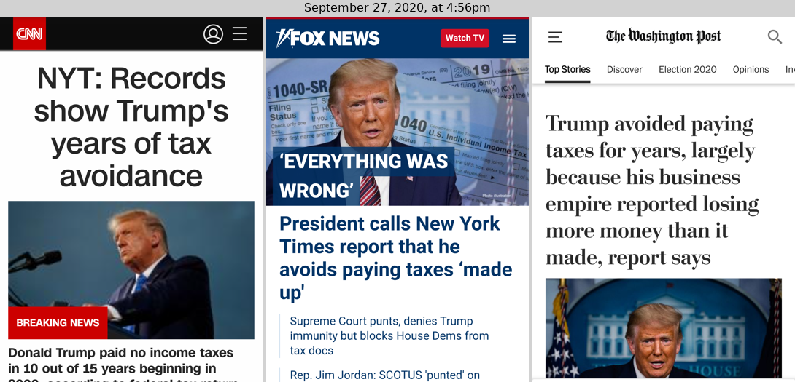

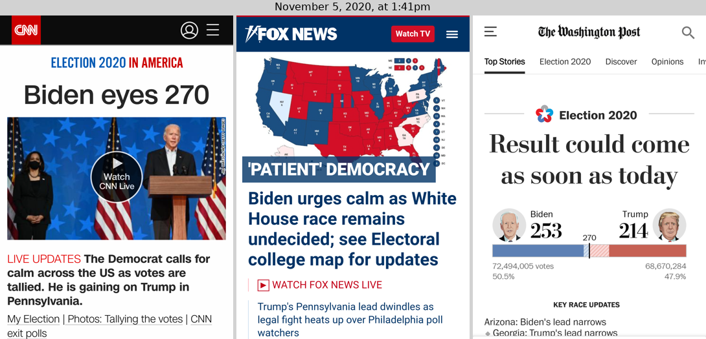

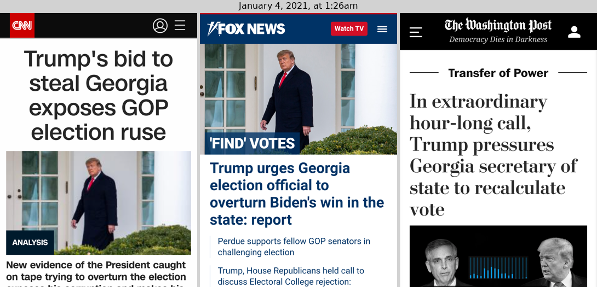

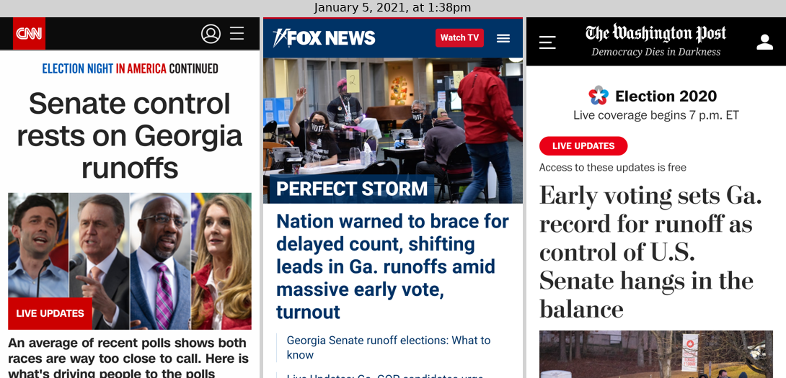

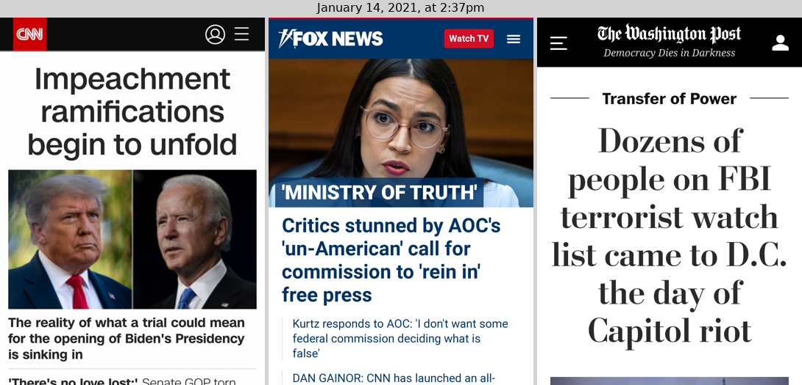

